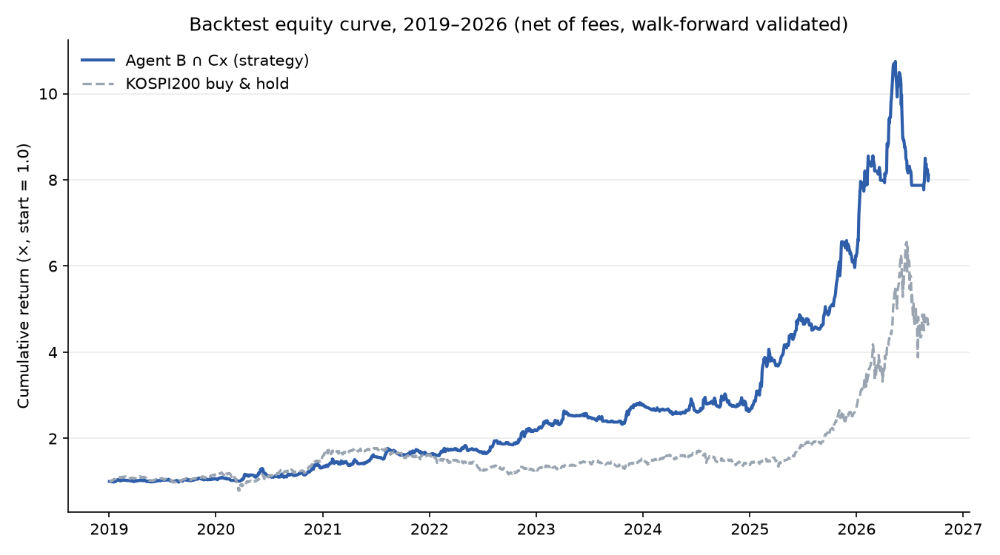
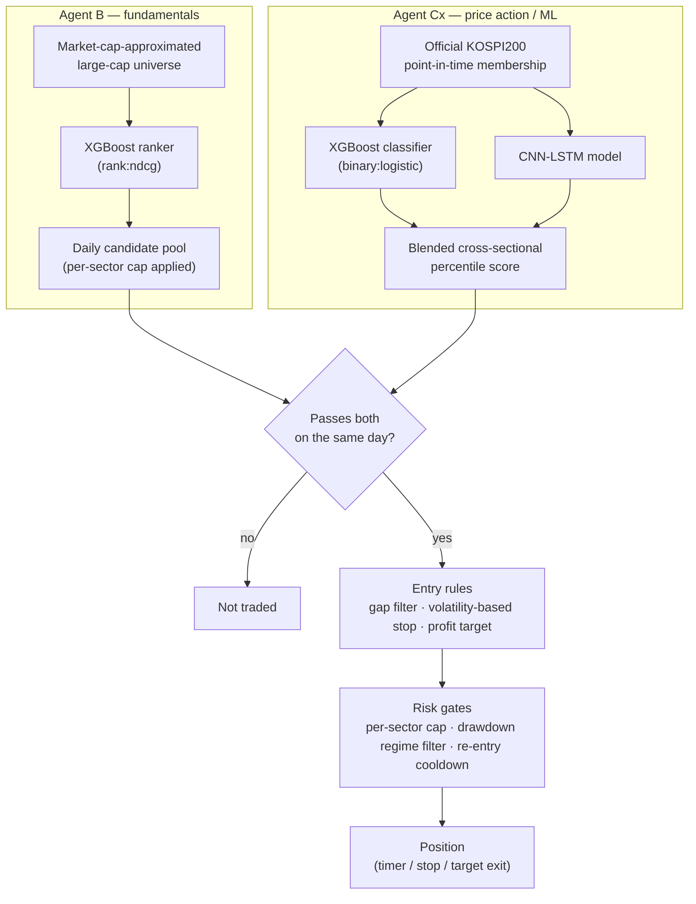

# Korean Large-Cap Equities Quant Research

**Walk-forward backtesting with a point-in-time universe and a risk-gated signal pipeline.**

This repo is a write-up of the methodology and validation discipline behind a long-running solo research project on large-cap Korean equities — not a pitch for the returns below. (Not literally "KOSPI200 stocks," either — see [Approach](#approach).) The system has been running live with personal capital, fully automated, since 2026-09-21 — this write-up is the validation trail that decision rests on, not a backtest done for its own sake. It is **not** a copy of the live trading system, though — the exact gating thresholds, position sizing, and risk-management parameters used in production are intentionally left out. What's actually here, and actually checkable: the point-in-time and cost-accounting discipline in [`src/`](src/), tests that pin down the claims in [`tests/`](tests/), and the mistakes that were found and fixed along the way, in [BUGS.md](BUGS.md) with real before/after numbers. The performance table below is not checkable from this repo — see the note under it before reading too much into it.

> ⚠️ **Not investment advice.** This is a personal research project shared for educational purposes. Past backtest performance does not predict future results, and nothing here should be read as a recommendation to buy or sell any security.

## Results (reference only — see caveat)

| | Strategy | KOSPI200 buy & hold |
|---|---|---|
| CAGR (2019–2026 YTD) | **31.36%** | 22.30% |
| Max drawdown | **-27.7%** | -40.8% |
| CAGR / \|MDD\| | **1.13** | 0.55 |
| Cumulative | **8.11×** | 4.68× |

**This is the walk-forward-validated number, not a full-period grid search.** The risk-management parameters (regime filter, re-entry cooldown, gate threshold, position sizing) were selected honestly — for each year, using only data from years strictly before it — and re-derived the same values from 2022 onward without ever seeing that year's own data. A separate, single full-period grid search (which *does* see the whole 2019–2026 window at once) lands on the same 2022–2026 parameters but reports a higher, look-ahead-inflated 32.48% CAGR / 1.17 — see [Methodology](#methodology--what-makes-this-credible-or-not) for both numbers and why the gap between them is informative.

> **These numbers can't be independently verified from this repo.** The code here ([`src/`](src/)) illustrates the techniques used, not the full pipeline — the actual backtest depends on licensed/collected Korean market data that isn't (and can't be) included. Read this table as "what came out of a walk-forward, cost-aware backtest for this approach," not as something you can reproduce or take on faith. The methodology sections below are the part you actually *can* evaluate.

Net of realistic transaction costs (commission + Korean securities transaction tax + slippage, ~0.41% round-trip). "KOSPI200 buy & hold" is the KODEX 200 ETF (069500) price series — a price return, not a total return with dividends reinvested, which flatters the strategy comparison somewhat. See also [Limitations](#limitations) — in particular, the most recent fold (2026) underperforms buy-and-hold by a wide margin, and the walk-forward selection itself turns out to be sensitive to how many candidate parameter sets are tried.



### Walk-forward results by year

Each year below is an out-of-sample fold: for the model that year is tested on, all training data is strictly earlier (annual walk-forward, no k-fold shuffling — see [`src/walkforward_validation.py`](src/walkforward_validation.py)). Shown per-year rather than only as one aggregate number, since an eight-year average can hide a lot of variance:

| Year | Strategy | KOSPI200 | Excess |
|---|---|---|---|
| 2019 | +6.1% | +15.8% | -9.7pp |
| 2020 | +25.7% | +35.6% | -9.9pp |
| 2021 | +21.5% | +3.0% | +18.5pp |
| 2022 | +34.8% | -24.2% | +59.0pp |
| 2023 | +27.5% | +24.9% | +2.6pp |
| 2024 | -5.7% | -9.4% | +3.7pp |
| 2025 | +136.3% | +94.2% | +42.1pp |
| 2026 (YTD, through Sep 4) | +30.5% | +73.8% | -43.3pp |

2019–2021 use a different, lighter configuration than 2022 onward (higher gate percentile, smaller position size, no cooldown/regime filter) — that's not an inconsistency, it's the point: a walk-forward selection process re-run at the start of each year, using only data from before it, judged the regime filter and cooldown *not worth it* for 2019–2021 and only adopted them starting 2022, without ever looking ahead at that year's own results. See [Methodology](#methodology--what-makes-this-credible-or-not) for the full schedule and how it was derived. (Compounding these year-by-year figures gets to 8.10×, a cent short of the 8.11× headline above — pure rounding noise from displaying each year to one decimal place, not a bug; each year's return is computed year-end to year-end, not first-trading-day to last-trading-day, so no boundary days are silently dropped.)

Three years (2019, 2020, 2026) underperform buy-and-hold outright, and 2026 underperforms by a wide margin — a strong KOSPI rally this strategy's regime/sector-cap risk controls didn't fully capture. Included deliberately rather than cut off at a more flattering point.

### Additional diagnostics

The headline CAGR comparison above isn't apples-to-apples on its own — buy-and-hold is always 100% invested, and a lower-drawdown strategy that's just sitting in cash more often isn't actually more skillful. These numbers are here to close that gap:

| | Value |
|---|---|
| Average cash allocation | 46.4% (i.e. ~53.6% average market exposure) |
| Annualized Sharpe ratio | 1.52 |
| Total trades (2019–2026) | 449 |
| Win rate | 43.7% |
| Average hold time | 12.2 trading days |
| Equal-weight universe benchmark (avg. return of all PIT KOSPI200 members, 2019–2026) | 2.04× cumulative |
| Cost sensitivity: CAGR at 2× assumed slippage (0.41% → 0.61% round-trip) | 28.53% (vs. 31.36% base) |

A few of these are worth reading correctly rather than at face value:

- **~46% average cash while still beating a fully-invested benchmark is the more interesting number than the CAGR itself** — the strategy achieved its return profile with a substantial chunk of capital sitting in cash on an average day (more so in 2019–2021, before the gate tightened and position sizing grew — see the year-by-year schedule above), not by being in the market more aggressively than buy-and-hold.
- **43.7% win rate is not a red flag on its own.** The exit rules are asymmetric by design — the profit target is set further from entry than the stop-loss — so more small losses than wins is expected. What matters is the per-trade expectancy (implied by the CAGR above), not the win rate in isolation: average per-trade return is +2.21%, well clear of the ~0.41% round-trip cost, so the number isn't hiding a pile of costs-flip-it-negative trades the way a tighter-margin strategy's might.
- **The equal-weight universe comparison is the more honest benchmark than the cap-weighted KOSPI200 ETF.** A cap-weighted index can be dominated by a handful of mega-caps; an approach that only beats the cap-weighted index but not the average stock in its own universe would be a much weaker result. Here the gap is *larger* against the equal-weight benchmark (8.11× vs. 2.04×) than against the cap-weighted one (8.11× vs. 4.68×).
- **Doubling the slippage assumption costs about 2.8 percentage points of CAGR, not the whole edge.** That's a reasonable sanity check that the result isn't a knife-edge function of the exact cost assumptions in [`src/transaction_costs.py`](src/transaction_costs.py) — though it's a stress test of one assumption, not proof of robustness to all of them.
- Strategy capacity (how much capital this scales to before market impact erodes the edge) isn't estimated here — it would need order-book/liquidity data this project doesn't have, so no number is given rather than a guessed one.

### Operational refinement: idle-cash parking (tested, not folded into the headline numbers)

Given the ~46% average cash allocation above, an obvious question: can that idle cash earn something instead of sitting at 0%? Tested one approach — parking it in a money-market-rate ETF (KODEX CD금리액티브, ticker 459580) between signals, using the exact same stock-order flow the strategy already uses for regular trades (no new account, no transfer step).

**Why not CMA/RP directly, which would be the more natural fit?** It would — near-instant liquidity, essentially zero price risk. But at this specific broker, a CMA sub-account can't be used to place stock orders directly, and there's no transfer API to move cash from CMA into the trading sub-account programmatically. That's a brokerage account/API limitation, not a property of RP/CMA as an instrument (and it isn't a deposit-insurance question either — the ETF route below isn't deposit-insured either, so that's not what's driving the choice). The money-market ETF was chosen specifically because it trades through the exact same stock-order API already in use, sidestepping that limitation entirely.

**Limitation on the test itself:** this ETF only has real trading history from 2023-06-08 — it didn't exist for most of the 2019–2026 backtest window. So this is only tested on 2023-06-08–2026-09-04 (~3.2 years), which is also why it isn't merged into the headline 2019–2026 table above — the two aren't the same period, and splicing a partial-period improvement into a full-period number is exactly the kind of thing this repo has tried to avoid elsewhere (see [BUGS.md](BUGS.md)).

| | No parking (cash earns 0%) | ETF-parked |
|---|---|---|
| CAGR | 43.22% | **44.20%** |
| MDD | -27.7% | **-27.0%** |
| CAGR / \|MDD\| | 1.56 | **1.64** |

Commission-only cost (this ETF is exempt from Korea's securities transaction tax, unlike regular stocks); modeled at the level of individual cash-in/cash-out events rather than net daily cash change, since 101 of the days in this window had two or more offsetting cash events that a naive daily-net approach would have under-charged for. Event-level accounting added about 25% more modeled commission (₩756,964 → ₩948,516 over the window) and the result barely moved (+1.03pp → +0.98pp CAGR), so the naive version wasn't hiding much.

### Statistical robustness checks

Two Monte Carlo-style checks, run to address a more basic question than anything above: is any of this distinguishable from noise?

*(Both checks below are re-run against the walk-forward-validated schedule above — 449 trades, 31.36% CAGR.)*

**1. Trade-sequencing bootstrap — is the reported MDD a fluke of ordering?** The actual daily returns (same set, 1,886 trading days) were reshuffled into 5,000 random orderings and the max drawdown recomputed for each. Final cumulative return is identical across every reshuffle by construction (compounding a fixed multiset of returns is order-independent — a useful sanity check that this ran correctly), but MDD is entirely order-dependent:

| | Value |
|---|---|
| Actual MDD | -27.7% |
| Reshuffled MDD — mean | -22.02% |
| Reshuffled MDD — 5th/95th percentile | -30.64% / -15.63% |
| Actual MDD's percentile in the reshuffled distribution | 12.1th |

The realized drawdown path was on the unlucky side — most reorderings of the exact same trades would have produced a smaller drawdown. Read this as "the CAGR isn't sequencing-dependent, but the specific -27.7% MDD partly is."

**2. Signal permutation test — is Agent Cx's stock selection distinguishable from random?** Agent B's pool and every risk/position-sizing rule were left untouched; only Agent Cx's score was replaced with random noise (same per-day pass rate as the real percentile gate, so trade frequency is comparable — only *which* names pass is randomized). Reran the full backtest 1,000 times:

| | Value |
|---|---|
| Random-signal CAGR — mean / median | 8.89% / 8.77% |
| Random-signal CAGR — 95th percentile | 16.18% |
| Random-signal CAGR — max of 1,000 runs | 25.55% |
| **Actual CAGR (31.36%) exceeds runs out of 1,000** | **1,000 / 1,000 (p ≈ 0.0000)** |
| Random-signal MDD — mean / median | -30.11% / -28.90% |

The real signal's CAGR clears every one of 1,000 random permutations — not marginal. MDD is more informative here than in the earlier (fixed-parameter) version of this test: the actual -27.7% is better than both the random mean and median (571 of 1,000 random runs had a worse drawdown), suggesting drawdown control here comes from a mix of the risk-management structure (regime filter, sector caps, stop losses — which stays fixed either way) *and* some contribution from stock selection itself, not purely the former. The return, in any case, comes overwhelmingly from Agent Cx actually picking the right names.

One honest caveat: both permutation runs isolate signal quality specifically — they don't speak to whether the risk-management parameter *selection* process itself is sound. That's a separate question, addressed by the walk-forward validation in [Methodology](#methodology--what-makes-this-credible-or-not) and the candidate-count sensitivity noted in [Limitations](#limitations).

## Approach

Two independent signal sources, combined by intersection rather than by blending scores into one number:



- **Agent B** — an XGBoost *ranking* model (`rank:ndcg`) trained on fundamentals, ranking a self-computed large-cap universe (a market-cap approximation, not the official index) to produce a daily candidate pool (with a per-sector cap, so the pool can't collapse into one hot sector).
- **Agent Cx** — a technical/price-action signal blending an XGBoost *classifier* (`binary:logistic`) with a CNN-LSTM variant, scoring stocks within the **actual, point-in-time official KOSPI200 membership**. (A classifier here, not a ranker like Agent B — the two agents were developed at different points in the project rather than to a shared design spec.)
- A stock only becomes a candidate when it clears **both** filters on the same day — i.e. when *both* a market-cap-based approximation and the official index agree it belongs in the large-cap set. This is a deliberate design choice, not an oversight: the two universes disagree on roughly 15–20% of names at any given time, and requiring agreement between two independently-derived definitions turned out to filter better than either one alone (tested directly, not assumed). The tradable universe is therefore this intersection, not "KOSPI200" in the strict sense.

Entries, stop-losses (volatility-based), and profit targets follow a fixed rule set; position risk is managed with per-sector caps and a drawdown-triggered regime filter that blocks new entries during KOSPI-wide selloffs. The exact numeric thresholds for all of this are withheld — the *structure* is what's documented here.

## Methodology / what makes this credible (or not)

- **Point-in-time universe.** KOSPI200 rebalances semi-annually with a real effective date (the trading day after the index provider's announcement, not the 1st of the month) — this matters for the Agent Cx side of the filter above. A backtest using "current members" applied retroactively is a look-ahead bug — see [`src/point_in_time_universe.py`](src/point_in_time_universe.py).
- **Order-aware labeling.** Any label built from "did price reach the target within N bars," checked without regard to whether the stop-loss was hit *first*, silently inflates label quality. See [`src/order_aware_labeling.py`](src/order_aware_labeling.py) for the concrete before/after.
- **Transaction costs modeled from day one on every new idea.** Commission on both legs, tax on the sell leg, slippage — see [`src/transaction_costs.py`](src/transaction_costs.py). More than one promising-looking signal turned out to be smaller than the round-trip cost once this was added honestly.
- **Annual walk-forward folds with an embargo**, not k-fold cross-validation — see [`src/walkforward_validation.py`](src/walkforward_validation.py). Each fold trains only on strictly-past data.
- **Risk-management parameters (regime filter, re-entry cooldown, gate threshold, position size) walk-forward-validated, not just grid-searched once.** Re-selected each year using only data from years strictly before it — genuinely honest at the selection step, unlike a one-time grid search over the whole period. Result: 2019–2021 get a lighter configuration (wider gate, smaller position, no cooldown/regime filter); 2022 onward converges on the same setup a full-period grid search finds independently, without that search ever seeing 2022–2026 data. The two approaches' backtests differ by only 1.12 percentage points of CAGR (31.36% walk-forward vs. 32.48% full-period, both net of costs) — evidence the setup isn't tightly fit to one stretch of history, not proof it's optimal. Disclosed rather than hidden: re-running the same walk-forward process with a much larger candidate grid (180 vs. 10 parameter combinations) reaches a similar CAGR (31.34%) but never selects the regime filter at all, and MDD is worse as a result (-30.4% vs. -27.7%) — a textbook multiple-comparisons effect (more candidates competing for the same handful of years of data makes the honest selection noisier, not more thorough). Both results are reported here rather than picking whichever looks better.
- **Relative, not absolute, entry thresholds.** Every time a fixed score cutoff was replaced with a same-day cross-sectional percentile cutoff, results improved and a look-ahead disappeared at the same time (the fixed cutoff had implicitly been tuned by looking at the whole evaluation period's score distribution).
- **Didn't assume the two blended Agent Cx sub-models need identical labels, and checked rather than argued.** They turned out to be trained on slightly different label definitions (a one-day offset in the assumed entry price) — not by original design, found partway through. Requiring every blended model to share one label isn't obviously the correct default in the first place: base models trained on different-but-related targets tend to make less-correlated mistakes, which is a good part of *why* blending helps at all. That's a reason this wasn't treated as an emergency, not a reason to skip checking — retrained one side to close the gap and compared both against the strategy's actual daily candidate pool, and found no statistically meaningful difference in selection quality (p≈0.46, small sample of days). Left as found rather than "fixed" on the strength of one modest test.

## Repo structure

```
src/            Standalone, runnable illustrations of the methodology pieces above
                (point-in-time universe, order-aware labeling, transaction costs,
                walk-forward folds) — simplified from the production code, no
                proprietary parameters.
tests/          pytest tests that pin down the actual claims made by src/ and
                this README (not just print-and-eyeball demos).
results/        Equity curve chart used above.
BUGS.md         Concrete before/after numbers for mistakes found and fixed.
```

There is no `data/` directory here — the underlying price/fundamentals data is either commercially licensed or collected from a brokerage API under terms that don't permit redistribution.

## How to run

```bash
pip install -r requirements-dev.txt

python src/point_in_time_universe.py
python src/order_aware_labeling.py
python src/transaction_costs.py
python src/walkforward_validation.py

pytest tests/
```

Requires Python 3.10+. Each `src/` file is self-contained and runs standalone (no shared setup, no external data) — `requirements.txt` alone (pandas, numpy) is enough to run them; `requirements-dev.txt` adds pytest for the test suite.

## Limitations

- The numbers above are backtest results, not a live track record — live performance (running since 2026-09-21) doesn't have enough history yet to report on its own, and should be expected to be more modest than the backtest above. One specific reason: the regime filter and re-entry cooldown are, at bottom, a bet that a future selloff will look enough like 2026's actual crash for the same trigger (a 20-day, -15% KOSPI drawdown) to catch it — and with only 8 years of history, that bet is validated as well as this project can validate it, not proven. The walk-forward selection process is genuinely honest (each year uses only prior data), and a much larger candidate search reaches a similar CAGR without it (see [Methodology](#methodology--what-makes-this-credible-or-not)) — but "honest selection" and "will definitely work on the next crash, which won't look identical to the last one" are different claims, and only the first one is backed by anything here.
- Universe and cost assumptions are Korea-specific (a KOSPI200-adjacent large-cap universe, Korean transaction tax); nothing here is a claim that the approach generalizes to other markets as-is.

## Tech stack

**Modeling & backtesting:** Python, PyTorch (CNN-LSTM), XGBoost, pandas — walk-forward training and backtesting built from scratch rather than an off-the-shelf backtesting library, to keep full control over the point-in-time and cost-accounting details above.

**Data pipeline:** the underlying data isn't redistributable (see above), but the collection side is its own piece of engineering, built on public sources:

- **Financial statements** — Open DART API (Korea's regulatory filing system), collected per-company and cached locally, with the reporting-date handling that makes a fundamentals factor point-in-time rather than retroactive.
- **Index membership** — `pykrx`, pulling KRX's own published KOSPI200 constituent files per rebalance date. This is what lets the point-in-time universe in [`src/point_in_time_universe.py`](src/point_in_time_universe.py) reflect actual historical membership rather than a reconstruction. Worth knowing before trusting a reconstructed one: measured against the official files at the same date, a market-cap-based approximation of "the top 200" differed on ~17% of names. That's why the Agent Cx side switched to the official source — Agent B keeps the approximation deliberately, and the disagreement between the two is the intersection filter described above.
- **Daily prices** — FinanceDataReader, cached to local Parquet.

## AI assistance

Built with Claude Code (Anthropic) as a research/pair-programming assistant throughout — implementation, debugging, and this writeup included. Research direction, validation decisions, and what to reject were mine.

## License

MIT — see [LICENSE](LICENSE). The code here is illustrative infrastructure, not the trading strategy itself.
