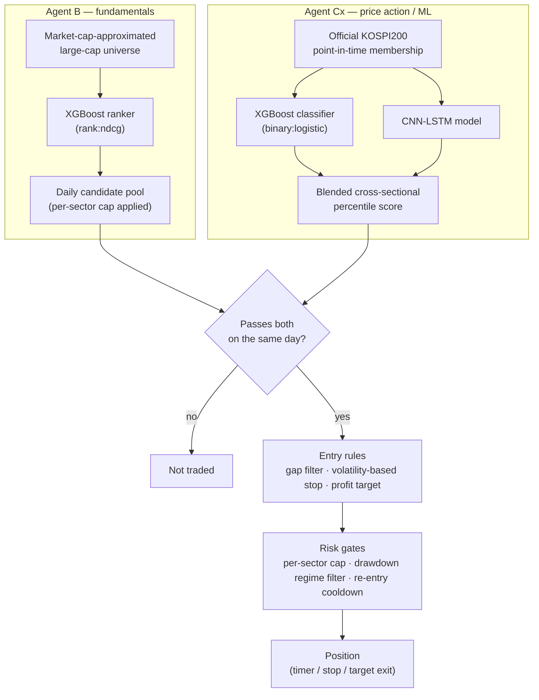

# Korean Large-Cap Equities Quant Research

**Walk-forward backtesting with a point-in-time universe and a risk-gated signal pipeline.**

This repo is a write-up of the methodology and validation discipline behind a long-running solo research project on large-cap Korean equities — not a pitch for the returns below. (Not literally "KOSPI200 stocks," either — see [Approach](#approach).) It is **not** a copy of the live trading system — the exact gating thresholds, position sizing, and risk-management parameters used in production are intentionally left out. What's actually here, and actually checkable: the point-in-time and cost-accounting discipline in [`src/`](src/), tests that pin down the claims in [`tests/`](tests/), and the mistakes that were found and fixed along the way, in [BUGS.md](BUGS.md) with real before/after numbers. The performance table below is not checkable from this repo — see the note under it before reading too much into it.

> ⚠️ **Not investment advice.** This is a personal research project shared for educational purposes. Past backtest performance does not predict future results, and nothing here should be read as a recommendation to buy or sell any security.

## Results (reference only — see caveat)

| | Strategy | KOSPI200 buy & hold |
|---|---|---|
| CAGR (2019–2026 YTD) | **32.48%** | 22.30% |
| Max drawdown | **-27.7%** | -40.8% |
| CAGR / \|MDD\| | **1.17** | 0.55 |
| Cumulative | **8.65×** | 4.68× |

> **These numbers can't be independently verified from this repo.** The code here ([`src/`](src/)) illustrates the techniques used, not the full pipeline — the actual backtest depends on licensed/collected Korean market data that isn't (and can't be) included. Read this table as "what came out of a walk-forward, cost-aware backtest for this approach," not as something you can reproduce or take on faith. The methodology sections below are the part you actually *can* evaluate.

Net of realistic transaction costs (commission + Korean securities transaction tax + slippage, ~0.41% round-trip). "KOSPI200 buy & hold" is the KODEX 200 ETF (069500) price series — a price return, not a total return with dividends reinvested, which flatters the strategy comparison somewhat. See also [Limitations](#limitations) — in particular, the most recent fold (2026) underperforms buy-and-hold by a wide margin, and the risk-management parameters have a meta-look-ahead issue.


### Walk-forward results by year

Each year below is an out-of-sample fold: for the model that year is tested on, all training data is strictly earlier (annual walk-forward, no k-fold shuffling — see [`src/walkforward_validation.py`](src/walkforward_validation.py)). Shown per-year rather than only as one aggregate number, since an eight-year average can hide a lot of variance:

| Year | Strategy | KOSPI200 | Excess |
|---|---|---|---|
| 2019 | +7.8% | +15.8% | -8.0pp |
| 2020 | +20.5% | +35.6% | -15.1pp |
| 2021 | +33.2% | +3.0% | +30.2pp |
| 2022 | +34.8% | -24.2% | +59.0pp |
| 2023 | +27.5% | +24.9% | +2.6pp |
| 2024 | -5.7% | -9.4% | +3.7pp |
| 2025 | +136.3% | +94.2% | +42.1pp |
| 2026 (YTD, through Sep 4) | +30.5% | +73.8% | -43.3pp |

(Compounding these year-by-year figures reproduces the 8.65× total above exactly — each year's return is computed year-end to year-end, not first-trading-day to last-trading-day, so the boundary days aren't silently dropped.)

Three years (2019, 2020, 2026) underperform buy-and-hold outright, and 2026 underperforms by a wide margin — a strong KOSPI rally this strategy's regime/sector-cap risk controls didn't fully capture. Included deliberately rather than cut off at a more flattering point.

### Additional diagnostics

The headline CAGR comparison above isn't apples-to-apples on its own — buy-and-hold is always 100% invested, and a lower-drawdown strategy that's just sitting in cash more often isn't actually more skillful. These numbers are here to close that gap:

| | Value |
|---|---|
| Average cash allocation | 50.4% (i.e. ~49.6% average market exposure) |
| Annualized Sharpe ratio | 1.59 |
| Total trades (2019–2026) | 373 |
| Win rate | 44.0% (gross and net of the ~0.41% round-trip cost — identical; see note below) |
| Average hold time | 12.4 trading days |
| Equal-weight universe benchmark (avg. return of all PIT KOSPI200 members, 2019–2026) | 2.04× cumulative |
| Cost sensitivity: CAGR at 2× assumed slippage (0.41% → 0.61% round-trip) | 29.90% (vs. 32.48% base) |

A few of these are worth reading correctly rather than at face value:

- **~50% average exposure while still beating a fully-invested benchmark is the more interesting number than the CAGR itself** — the strategy achieved its return profile with roughly half its capital sitting in cash on an average day, not by being in the market more aggressively than buy-and-hold.
- **44% win rate is not a red flag on its own.** The exit rules are asymmetric by design — the profit target is set further from entry than the stop-loss — so more small losses than wins is expected. What matters is the per-trade expectancy (implied by the CAGR above), not the win rate in isolation. It's defined as "exit price above entry price," checked both before and after the ~0.41% round-trip cost — 0 of 373 trades flip from win to loss once costs are applied (average gross per-trade return is +2.63%, well clear of the cost), so the number isn't hiding a pile of costs-flip-it-negative trades the way a tighter-margin strategy's might.
- **The equal-weight universe comparison is the more honest benchmark than the cap-weighted KOSPI200 ETF.** A cap-weighted index can be dominated by a handful of mega-caps; an approach that only beats the cap-weighted index but not the average stock in its own universe would be a much weaker result. Here the gap is *larger* against the equal-weight benchmark (8.65× vs. 2.04×) than against the cap-weighted one (8.65× vs. 4.68×).
- **Doubling the slippage assumption costs about 2.6 percentage points of CAGR, not the whole edge.** That's a reasonable sanity check that the result isn't a knife-edge function of the exact cost assumptions in [`src/transaction_costs.py`](src/transaction_costs.py) — though it's a stress test of one assumption, not proof of robustness to all of them.
- Strategy capacity (how much capital this scales to before market impact erodes the edge) isn't estimated here — it would need order-book/liquidity data this project doesn't have, so no number is given rather than a guessed one.

## Approach

Two independent signal sources, combined by intersection rather than by blending scores into one number:



- **Agent B** — an XGBoost *ranking* model (`rank:ndcg`) trained on fundamentals, ranking a self-computed large-cap universe (a market-cap approximation, not the official index) to produce a daily candidate pool (with a per-sector cap, so the pool can't collapse into one hot sector).
- **Agent Cx** — a technical/price-action signal blending an XGBoost *classifier* (`binary:logistic`) with a CNN-LSTM variant, scoring stocks within the **actual, point-in-time official KOSPI200 membership**. (A classifier here, not a ranker like Agent B — the two agents were developed at different points in the project rather than to a shared design spec.)
- A stock only becomes a candidate when it clears **both** filters on the same day — i.e. when *both* a market-cap-based approximation and the official index agree it belongs in the large-cap set. This is a deliberate design choice, not an oversight: the two universes disagree on roughly 15–20% of names at any given time, and requiring agreement between two independently-derived definitions turned out to filter better than either one alone (tested directly, not assumed). The tradable universe is therefore this intersection, not "KOSPI200" in the strict sense.

Entries, stop-losses (volatility-based), and profit targets follow a fixed rule set; position risk is managed with per-sector caps and a drawdown-triggered regime filter that blocks new entries during KOSPI-wide selloffs. The exact numeric thresholds for all of this are withheld — the *structure* is what's documented here.

## Methodology / what makes this credible (or not)

- **Point-in-time universe.** KOSPI200 rebalances semi-annually with a real effective date (the trading day after the index provider's announcement, not the 1st of the month) — this matters for the Agent Cx side of the filter above. A backtest using "current members" applied retroactively is a look-ahead bug — see [`src/point_in_time_universe.py`](src/point_in_time_universe.py).
- **Order-aware labeling.** Any label built from "did price reach the target within N bars," checked without regard to whether the stop-loss was hit *first*, silently inflates label quality. See [`src/order_aware_labeling.py`](src/order_aware_labeling.py) for the concrete before/after.
- **Transaction costs modeled from day one on every new idea.** Commission on both legs, tax on the sell leg, slippage — see [`src/transaction_costs.py`](src/transaction_costs.py). More than one promising-looking signal turned out to be smaller than the round-trip cost once this was added honestly.
- **Annual walk-forward folds with an embargo**, not k-fold cross-validation — see [`src/walkforward_validation.py`](src/walkforward_validation.py). Each fold trains only on strictly-past data.
- **Relative, not absolute, entry thresholds.** Every time a fixed score cutoff was replaced with a same-day cross-sectional percentile cutoff, results improved and a look-ahead disappeared at the same time (the fixed cutoff had implicitly been tuned by looking at the whole evaluation period's score distribution).

## Repo structure

```
src/            Standalone, runnable illustrations of the methodology pieces above
                (point-in-time universe, order-aware labeling, transaction costs,
                walk-forward folds) — simplified from the production code, no
                proprietary parameters.
tests/          pytest tests that pin down the actual claims made by src/ and
                this README (not just print-and-eyeball demos).
results/        Equity curve chart used above.
BUGS.md         Concrete before/after numbers for mistakes found and fixed.
```

There is no `data/` directory here — the underlying price/fundamentals data is either commercially licensed or collected from a brokerage API under terms that don't permit redistribution.

## How to run

```bash
pip install -r requirements-dev.txt

python src/point_in_time_universe.py
python src/order_aware_labeling.py
python src/transaction_costs.py
python src/walkforward_validation.py

pytest tests/
```

Requires Python 3.10+. Each `src/` file is self-contained and runs standalone (no shared setup, no external data) — `requirements.txt` alone (pandas, numpy) is enough to run them; `requirements-dev.txt` adds pytest for the test suite.

## Limitations

- Backtest results, not a live track record. The final risk-management parameters (regime filter threshold, re-entry cooldown) were arrived at after having already seen how a 2026 drawdown period played out — a form of meta-look-ahead that likely makes the backtest somewhat optimistic. Live performance should be expected to be more modest.
- Universe and cost assumptions are Korea-specific (a KOSPI200-adjacent large-cap universe, Korean transaction tax); nothing here is a claim that the approach generalizes to other markets as-is.

## Tech stack

**Modeling & backtesting:** Python, PyTorch (CNN-LSTM), XGBoost, pandas — walk-forward training and backtesting built from scratch rather than an off-the-shelf backtesting library, to keep full control over the point-in-time and cost-accounting details above.

**Data pipeline:** the underlying data isn't redistributable (see above), but the collection side is its own piece of engineering, built on public sources:

- **Financial statements** — Open DART API (Korea's regulatory filing system), collected per-company and cached locally, with the reporting-date handling that makes a fundamentals factor point-in-time rather than retroactive.
- **Index membership** — `pykrx`, pulling KRX's own published KOSPI200 constituent files per rebalance date. This is what lets the point-in-time universe in [`src/point_in_time_universe.py`](src/point_in_time_universe.py) reflect actual historical membership rather than a reconstruction. Worth knowing before trusting a reconstructed one: measured against the official files at the same date, a market-cap-based approximation of "the top 200" differed on ~17% of names. That's why the Agent Cx side switched to the official source — Agent B keeps the approximation deliberately, and the disagreement between the two is the intersection filter described above.
- **Daily prices** — FinanceDataReader, cached to local Parquet.

## AI assistance

Built with Claude Code (Anthropic) as a research/pair-programming assistant throughout — implementation, debugging, and this writeup included. Research direction, validation decisions, and what to reject were mine.

## License

MIT — see [LICENSE](LICENSE). The code here is illustrative infrastructure, not the trading strategy itself.
